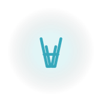

# Aurakey

<div align="center">
  
  
  **Bộ gõ tiếng Việt hiện đại cho macOS**
  
  [](https://github.com/cudin-etn/aurakey/releases)
  [](https://www.apple.com/macos/)
  [](LICENSE)
</div>

---

## 📖 Giới thiệu

**Aurakey** là bộ gõ tiếng Việt cho macOS, được phát triển dựa trên mã nguồn của **XKey**, **OpenKey** và **Unikey**.

Mục tiêu: gọn nhẹ, sạch sẽ, tương thích macOS mới nhất, hỗ trợ auto-update.

### ✨ Tính năng

- ⚡ **Hiệu suất cao** — Viết bằng Swift native, tối ưu cho macOS
- ⌨️ **Đa kiểu gõ** — Telex, VNI, Simple Telex 1 & 2
- 📝 **Đa bảng mã** — Unicode, TCVN3 (ABC), VNI Windows
- 🔤 **Gõ nhanh** — Quick Telex, Quick Start/End Consonant
- 📋 **Macro** — Tạo từ viết tắt, import/export, tự động viết hoa
- 🔄 **Chuyển đổi văn bản** — Hoa/thường, bảng mã, xoá dấu
- 📖 **Kiểm tra chính tả** — Từ điển tiếng Việt (200KB, GPL), từ điển cá nhân
- 🧠 **Smart Switch** — Nhớ ngôn ngữ theo từng ứng dụng, tự động chuyển
- 🪄 **Window Title Rules** — Tuỳ chỉnh engine theo từng web/app
- 🔀 **Quản lý Input Source** — Bật/tắt theo từng input source
- 🛟 **Temp Off Toolbar** — Thanh công cụ nổi tại con trỏ
- 💎 **Cursor Mode HUD** — Huy hiệu V/E kính mờ cạnh con trỏ khi đổi ngôn ngữ
- ⏪ **Undo gõ** — Hoàn tác thêm dấu
- 💾 **Backup/Restore** — Sao lưu toàn bộ cài đặt
- 🔄 **Auto-update** — Cập nhật tự động qua Sparkle

---

## 📥 Cài đặt

### Yêu cầu

- macOS 13.0 (Ventura) trở lên
- Quyền Accessibility

### Từ Release

1. Vào [Releases](https://github.com/cudin-etn/aurakey/releases) tải file `.zip` mới nhất
2. Giải nén, copy `Aurakey.app` vào thư mục Applications
3. Mở Aurakey, cấp quyền Accessibility khi được yêu cầu

> ⚠️ Vì app không có chữ ký Apple Developer, macOS có thể chặn. Chạy lệnh sau để bỏ qua:
> ```bash
> xattr -dr com.apple.quarantine /Applications/Aurakey.app
> ```

### Build từ mã nguồn

```bash
git clone https://github.com/cudin-etn/aurakey.git
cd aurakey
xcodebuild -project Aurakey.xcodeproj -scheme Aurakey -configuration Release -derivedDataPath ./build -arch arm64 CODE_SIGN_IDENTITY="-" CODE_SIGN_STYLE=Manual CODE_SIGNING_REQUIRED=NO build
cp -R "./build/Build/Products/Release/Aurakey.app" .
```

---

## 🛠️ Phát triển

### Cấu trúc dự án

```
Aurakey/
├── Shared/                # Code dùng chung
│   ├── SharedSettings.swift
│   ├── AppBehaviorDetector.swift
│   └── DebugLogger.swift
├── Aurakey/               # App chính
│   ├── App/               # Entry point, AppDelegate
│   ├── Core/Engine/       # Engine gõ tiếng Việt
│   ├── Core/Models/       # Data models
│   ├── EventHandling/     # Xử lý phím tắt, EventTap
│   ├── UI/                # SwiftUI views
│   └── Utilities/         # Helpers
├── AurakeyTests/          # Unit tests
├── scripts/               # Công cụ hỗ trợ
└── .github/workflows/     # CI/CD
```

### Công nghệ

| Công nghệ | Mục đích |
|-----------|----------|
| **Swift** | 100% native |
| **SwiftUI** | Giao diện hiện đại |
| **Core Graphics Events** | Keyboard injection |
| **Accessibility API** | Focus detection (AXObserver) |
| **Sparkle** | Auto-update framework |

---

## 🙏 Cảm ơn

Aurakey được phát triển dựa trên mã nguồn của:
- [XKey](https://github.com/codetay/XKey) — Bộ gõ tiếng Việt macOS mã nguồn mở
- [OpenKey](https://github.com/tuankpa/OpenKey) — Bộ gõ tiếng Việt mã nguồn mở
- [Unikey](https://www.unikey.org/) — Bộ gõ tiếng Việt phổ biến

---

## 📄 Giấy phép

Dự án được phát hành dưới giấy phép MIT. Xem file [LICENSE](LICENSE).

---

<div align="center">
  Made with ❤️ & ☕ by TDEV.STUDIO
  
  ⭐ Nếu bạn thấy hữu ích, hãy cho dự án một star!
</div>
